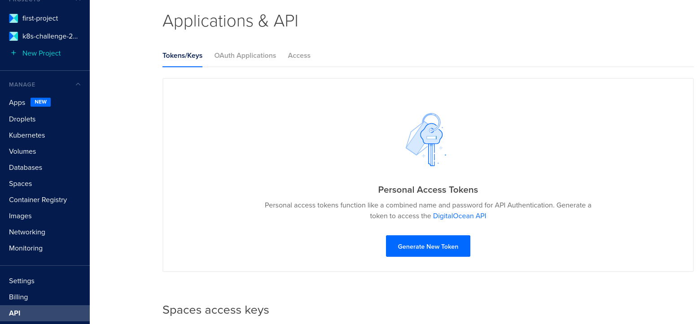
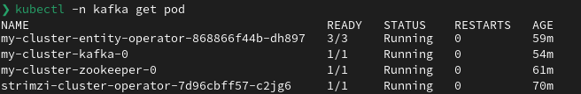
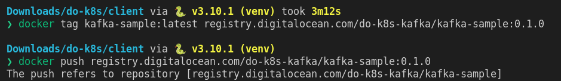

# Kafka on DigitalOcean Kubernetes with the Strimzi operator

As part of the [DigitalOcean Kubernetes challenge](https://www.digitalocean.com/community/pages/kubernetes-challenge) we want to learn how to deploy a message queue on a managed Kubernetes cluster.

## Step0: Creating a Kubernetes cluster

First of all, we need to create a Kubernetes cluster. For this we can use DigitalOcean's managed offering.

We have two choices (plus a [Terraform module](https://registry.terraform.io/providers/digitalocean/digitalocean/latest/docs/resources/kubernetes_cluster) if you're into that):

- Via [the web console](#using-the-web-console)
- Via [the cli](#using-the-cli)

Remember also to download and install _kubectl_ to be able to access our cluster from the CLI.

### Using the web console

First of all, login to your Digital Ocean console and click on _Kubernetes_, from there you can create a cluster


As you can see, the creation experience is very straightforward with a single page of simple essential settings like the version, where should the nodes be allocated, and how many of them should be available.

A nice plus is that you can see right away how much will the cluster cost in a very transparent way.

After creating a cluster you will be redirected to the overview page telling you the status of the cluster and giving you one-click access to the configuration download, documentation, and also some readily available applications.


By clicking on _Nodes_, the cluster will initially be in the provisioning state


But after a short while the nodes will become active and our cluster will be running


From this moment on we can simply download the config file, point our kubectl to it and start hacking. Pretty simple.

### Using the CLI

For those of you more inclined to use CLI for everything (or for scripts), DO has created a cli called _doctl_ allowing us to perform all of the administrative actions directly from the terminal.

#### Configuring access to the API

Since I am using Fedora I was able to directly install _doctl_ from my package manager but installation in other distributions is equally easy: download, `chmod +x` and you're ready to use it.

Before using the CLI, a token has to be created. This can be done from the web console by clicking on _API_ and then on _Generate new token_.




Our token will then be readily copy-pastable into the CLI


After that, run `doctl auth init` to setup a token


We are now ready to create a cluster

#### Creating a Kubernetes cluster

We can create a cluster by running `doctl kubernetes cluster create <cluster-name>`


Here I have selected the nodes location, size, and Kubernetes version. The available options can be easily listed by running `doctl kubernetes options <parameter-name>`


As with the web case, we need to setup _kubectl_, this can be easily done either by allowing _doctl_ to automatically configure access or by downloading the kubeconfig manually


### Checking that everything worked

Run a sample command with _kubectl_ to see if everything worked like `kubectl get nodes`


By running `kubectl get storageclasses` you will see that a default storage provider is already installed, automatically taking care of the storage needs of our stateful workloads


## Step1: Installing the Strimzi Kafka operator

If you ever tried to install Kafka you surely would know that it is an immensely powerful yet complex beast. Thankfully, in Kubernetes we have the possibility to use _operators_ which basically are computer programs allowing to automate the procedures revolving around installing, configuring, and maintaining softwares.

One of these in [Strimzi](strimzi.io) that allows us to automatically and declaratively state our Kafka configuration and painlessly configure the broker.

As of now, the available Strimzi version is `0.27.0`.

To install Strimzi first of all we need to download the [latest release package from GitHub](https://github.com/strimzi/strimzi-kafka-operator/releases/download/0.27.0/strimzi-0.27.0.tar.gz) and extract it somewhere.

By default Strimzi installs everything inside of the `myproject` namespace, let's change that to `kafka` by entering inside the extracted Strimzi folder and running

```sh
sed -i 's/namespace: .*/namespace: kafka/' install/cluster-operator/*RoleBinding*.yaml
```

Then enter the `install` directory and:

- Create the `kafka` namespace with `kubectl create ns kafka`
- Install the operator with `kubectl apply -f cluster-operator -n kafka`


If we did everything correctly, by running `kubectl -n kafka get pod` we will see the operator running with a ready status.


Now we need to deploy Kafka itself.

The way we do that is by [creating a custom resource describing the desired state of our broker](manifests/kafka.yaml).

For this example, this configuration will be used:

```yaml
apiVersion: kafka.strimzi.io/v1beta2
kind: Kafka
metadata:
  name: my-cluster # The name of the cluster
spec:
  kafka: # Configuration for the broker itself
    replicas: 1 # How many Kafka brokers we are using
    listeners:
      - name: plain
        port: 9092
        type: internal # We want Kafka to be a service accessible only from within our cluster
        tls: false
    storage:
      type: jbod # Merge the provided storages
      volumes:
      - id: 0
        type: persistent-claim # Leverage the preinstalled storage provisioner
        size: 100Gi
        deleteClaim: false
    config:
      # Reduce the number of replicas for this example
      offsets.topic.replication.factor: 1
      transaction.state.log.replication.factor: 1
      transaction.state.log.min.isr: 1
      default.replication.factor: 1
      min.insync.replicas: 1
  zookeeper: # Configuration for the Zookeeper cluster
    replicas: 1
    storage:
      type: persistent-claim # Leverage the preinstalled storage provisioner
      size: 100Gi
      deleteClaim: false
  entityOperator: # Configuration for the Kafka user and topic automatic provisioner
    topicOperator: {}
    userOperator: {}
```

Deploying this manifest to the cluster with `cd manifests && kubectl -n kafka apply -f kafka.yml`, Strimzi will start the deployment of the Kafka broker


After a short while `kubectl -n kafka get pods` will show a running Kafka + Zookeeper cluster



To wait until Kafka is ready to manage our requests run `kubectl -n kafka wait kafka/<cluster-name> --for-condition=Ready --timeout=300s`


## Step2: Deploying a sample application

Now, we have Kafka running so let's use it to run a simple application.

### Which application

The simple application we will be building is a basic multi-producer, single-consumer system (all code can be found inside of this repository `image` folder).

What we want to do is to have multiple producers generating random numbers and publishing them to a topic while a consumer listen to the generated values.

In Python, these two functions sum up this simple logic

```python
def consume():
    print('Starting as consumer')
    # We create a consumer
    consumer = KafkaConsumer(bootstrap_servers = must_env_var('BOOTSTRAP_SERVERS'))
    # We are interested in messages bound to a particular topic
    consumer.subscribe(topics = must_env_var('TOPIC_NAME'))
    for message in consumer: # We iterate over every received message
        # Messages are raw bytes, to display them, we convert the bytes to a string
        decoded_message = message.value.decode('utf-8')
        # Finally, we display the received message
        print(f'Received: {decoded_message}')

def produce():
    identity = socket.gethostname()
    print(f'Starting as producer with identity {identity}')
    # We create a producer
    producer = KafkaProducer(bootstrap_servers = must_env_var('BOOTSTRAP_SERVERS'))
    topic = must_env_var('TOPIC_NAME')
    while True: # We will do this indefinitely
        # We generate a random number
        n = random.randint(10, 100)
        # We build a string like "15 from my-app-1"
        message = str(n) + ' from ' + identity
        # We send the message
        send_result = producer.send(topic, message.encode('utf-8'))
        # We wait for the message to be delivered to the broker
        send_result = send_result.get(timeout = 10.0)
        print(f'Produced {n}')
        # We wait between 1 and 2 seconds
        time.sleep(1.0 + random.random())
```

We then package the application with a simple Dockerfile leveraging the official `python` image.

```dockerfile
FROM python:3.10.1
WORKDIR /opt/app
COPY requirements.txt .
RUN pip install -r requirements.txt
WORKDIR /opt/app/src
ADD src/ .
ENTRYPOINT [ "/usr/bin/env", "python3", "." ]
```

### Deploying the topic

To exchange information between the producers and the consumer we need a common topic.

Thanks to Strimzi, creation of such topic is done by simply deploying [a Kubernetes manifest](manifests/topic.yaml) describing the topic.

```yaml
apiVersion: kafka.strimzi.io/v1beta2
kind: KafkaTopic
metadata:
  name: my-topic # Name of the topic
  labels:
    strimzi.io/cluster: "my-cluster" # Name of the cluster
spec:
  partitions: 3
  replicas: 1
```

Once the topic is deployed, Strimzi will take care of creating it inside of the Kafka cluster

### Deploying the application

We have now a Docker image, but we need also to create a deployment descriptor for our application.

The one I used can be found in [manifests/application.yaml](manifests/application.yaml) which defines three producers generating data for a single consumer.

```yaml
# Producers
---
apiVersion: apps/v1
kind: Deployment
metadata:
  name: kafka-producer
spec:
  replicas: 3 # Three producers
  selector:
    matchLabels:
      app.kubernetes.io/name: kafka-test
      app.kubernetes.io/component: producer
  template:
    metadata:
      labels:
        app.kubernetes.io/name: kafka-test
        app.kubernetes.io/component: producer
    spec:
      affinity:
        # We would like the producers to spread out between nodes
        podAntiAffinity:
          preferredDuringSchedulingIgnoredDuringExecution:
          - weight: 1
            podAffinityTerm:
              topologyKey: kubernetes.io/hostname
              labelSelector:
                matchLabels:
                  app.kubernetes.io/name: kafka-test
                  app.kubernetes.io/component: producer
      containers:
      - name: producer
        image: registry.digitalocean.com/do-k8s-kafka/kafka-sample:0.1.2 # The Docker image location
        env:
        - { name: SAMPLE_ROLE, value: producer }
        - { name: BOOTSTRAP_SERVERS, value: my-cluster-kafka-bootstrap } # Identity of Kafka inside of the cluster
        - { name: TOPIC_NAME, value: my-topic } # The Kafka topic name
# Consumer
---
apiVersion: apps/v1
kind: Deployment
metadata:
  name: kafka-consumer
spec:
  replicas: 1 # One consumer
  selector:
    matchLabels:
      app.kubernetes.io/name: kafka-test
      app.kubernetes.io/component: consumer
  template:
    metadata:
      labels:
        app.kubernetes.io/name: kafka-test
        app.kubernetes.io/component: consumer
    spec:
      containers:
      - name: consumer
        image: registry.digitalocean.com/do-k8s-kafka/kafka-sample:0.1.2 # The Docker image location
        env:
        - { name: SAMPLE_ROLE, value: consumer }
        - { name: BOOTSTRAP_SERVERS, value: my-cluster-kafka-bootstrap } # Identity of Kafka inside of the cluster
        - { name: TOPIC_NAME, value: my-topic } # The Kafka topic name
```

#### Where to put the image

We now have a problem: how to run our Docker image inside of the cluster?

With DigitalOcean it's extremely easy to get a Docker registry and integrate it with Kubernetes.

Go on the web console and click on _Container registry_ to create a registry


It will start empty, ready to receive our images


You can also create the registry via the CLI by running `doctl registry create <name>`


Then, to push our images you just need to:

copy the URL from the website


automatically login to the Registry by running `doctl registry login`


tag and push your image



Once the image is uploaded, you will see it in the overview


We now need to configure our Kubernetes cluster to access this registry, this can be automatically done from the settings page


Once integrated, every namespace inside of our cluster will be able to access the registry via an automatically generated secret, bound to the default service account


### Finally deploying

With our image uploaded we can finally deploy with `kubectl -n kafka apply -f application.yaml`


After a while everything will be up and running


To see if everything is working correctly we can look at the logs of the consumer and we will indeed see our producers sending us their random numbers.


## Closing remarks

First of all thanks to DigitalOcean for this opportunity, I'd like to point out how easy the experience was: the interfaces are great and intuitive to operate, the cluster itself is ready to run after literally two clicks, the registry integration worked flawlessly.

I had a great impression with how straightforward it was to get my (simple) application running because all of the pain points are already addressed for you:

- Upgrades are automatic
- Storage is automatic and already configured
- Registry has a nice UI and is integrated
- Exposing services can easily be done by simply setting `type: LoadBalancer` and DO will create a loadbalancer

Included with the service, and without any configuration whatsoever you also get some basic metrics


I also appreciated the possibility to externally attach a disk provisioned for Kubernetes (this could be useful is something goes awry inside of the cluster)


My final word of praise is about the cluster architecture itself: the only non-vanilla service is their node agent, while networking is managed by an open source solution agnostic to the provider allowing DO to reap the benefits of the Cilium community and us to leverage the ecosystem around. 


The nodes themselves are nothing but Debian cloud images with containerd, a pragmatic choice for a production ready product.


This service fully embraced the KISS phylosophy, leveraging existing products to their maximum and smoothing out the pain points. Bravo DigitalOcean!